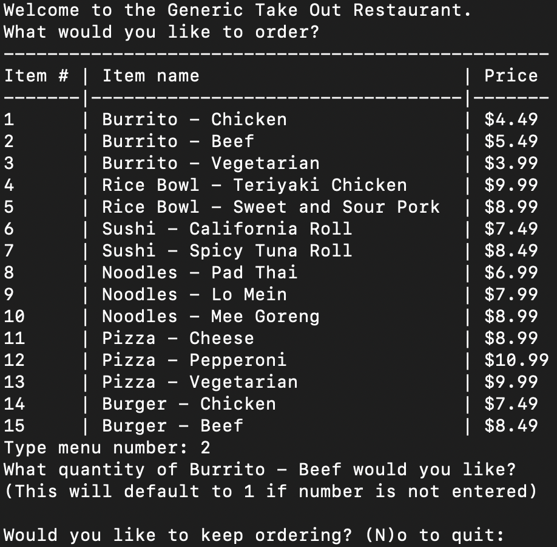
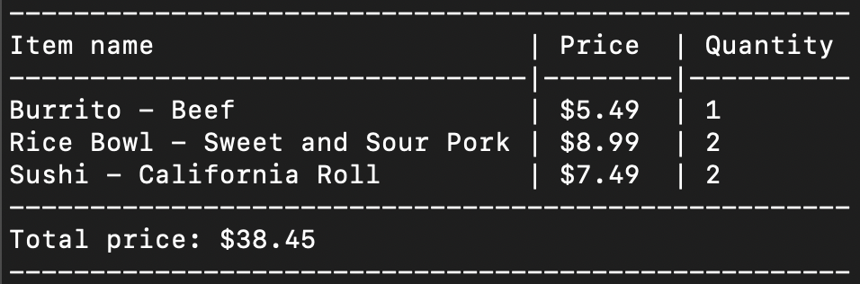
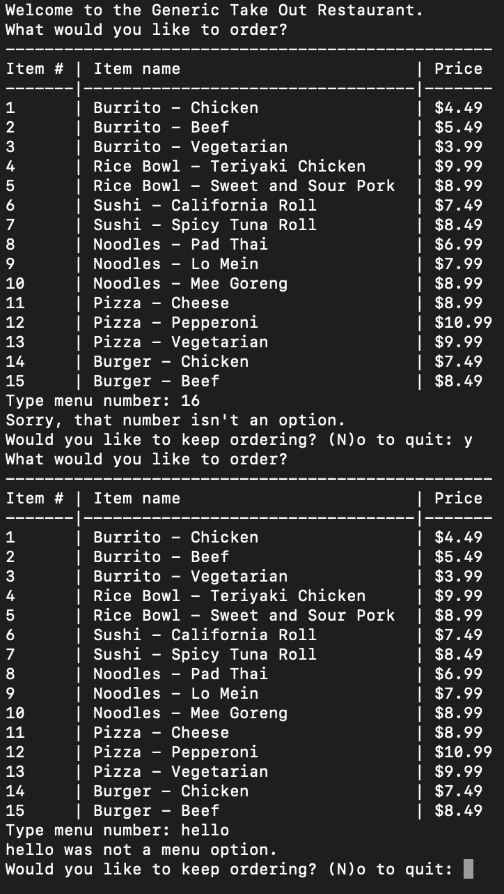

# Module 21 Challenge: Takeout Restaurant Menu and Order System

## Your Task

Welcome to this week's Challenge! This week, you will use your new Python skills to build out a program that allows customers to place orders with a takeout restaurant, and receive an itemized receipt.

You have been provided with some starter code. This starter code contains various functions that will help you print the menu and receipt.

You may read through all of the code, but you only need to add code to the `place_order()`, `update_order()`, and `print_itemized_receipt()` functions at the top of your starter file. Do not make any changes to the code below those functions as it may lead to errors.

The core skills you will utilize from your coding experience, specifically Python, will be conditionals, loops, functions, and list comprehension. Data used in this Challenge will be stored in a dictionary and a list of dictionaries.

## User Story

```text
AS A hungry customer with hearing and vocal impairments
I WANT to view a menu, place an order, and see my receipt
SO THAT I don't have to interact with a person until I collect my food
```

## Acceptance Criteria

```text
GIVEN A restaurant order system
WHEN I launch the program
THEN I view all of the menu items listed with their category, name, and price
WHEN I select an item from the menu by entering a number
THEN I am asked the quantity of that item I want to order
WHEN I choose the quantity
THEN I am asked if I would like to continue ordering or not
WHEN I don't choose a valid quantity
THEN I automatically receive 1 of that menu item
WHEN I continue ordering
THEN I view the menu again
WHEN I quit ordering
THEN I am shown my itemized order receipt and total price
WHEN I enter an invalid response for the menu item
THEN I am given an error message
```

## Mock-Up

The following image shows a mock-up of the restaurant menu and ordering system:



The following image shows a mock-up of the customer's receipt at the end of the program:



The following image shows a mock-up of the customer typing incorrect inputs for the menu options:



## Getting Started

This is an autograded assignment, meaning that you will follow the link below to open the assignment in a new window in the Ed platform. You will modify the existing starter code files to meet the requirements listed below.

> **note** If you need any assistance with the Ed platform, please review the information on submitting assignments in Module 0.

## Grading Requirements

This Challenge is graded based on the following criteria:

### `place_order()` function 40%

The `place_order()` function must have:

* A continuous loop that continues displaying the menu and asking the customer what they want until the customer quits ordering. (6 points)

* A nested loop that loops through the menu dictionary to display the menu category and item followed by the price. (10 points)

* A conditional statement that asks the customer if they want to continue ordering and exits the continuous loop if they type 'n' or 'N'. (6 points)

* A list comprehension that calculates the total price for each order item by multiplying the quantity by the price. (8 points)

* A `sum()` calculation with the list comprehension to calculate the total order price, rounded to 2 decimal places. (4 points)

* A return statement that returns the customer's order in a list of dictionaries and the total order price. (6 points)

### `update_order()` function 45%

The `update_order()` function must have:

* A conditional statement that checks if the customer's input string can be converted to an integer and prints an error message if it does not. (6 points)

* Type casting to convert the customer's input string to an integer. (4 points)

* A conditional statement that checks if the customer's input is an item on the menu and prints an error message if it is not. (6 points)

* A prompt to the customer that prints the name of the menu item to the user and asks the quantity they would like to order. (4 points)

* A conditional statement that checks if the input quantity can be converted to an integer, then converts it to an integer, and defaults to 1 if it does not. (10 points)

* The order list is updated with the customer's item name, price, and quantity stored in a dictionary. (10 points)

* The updated order list is returned from the function. (5 points)

### `print_itemized_receipt()` function 15%

The `print_itemized_receipt()` function must have:

* A loop that loops through each element of the order list. (5 points)

* The item name, price, and quantity from each dictionary in the order list are stored as variables. (5 points)

* The item name, price, and quantity are sent to the `print_receipt_line` function in the correct order. (5 points)

## How to Submit the Challenge

Follow the link below to open this autograded assignment in a new tab. Once you have completed the assignment in the Ed platform, submit it and you will return to Bootcamp Spot.

> **note** You are allowed to miss up to two Challenge assignments and still earn your certificate. If you complete all Challenge assignments, your lowest two grades will be dropped. If you wish to skip this assignment, click Next, and move on to the next Module.

> **important** No matter how difficult the course becomes, you must always turn in original work. Plagiarism is not tolerated. If your instructional or support staff determine that you have plagiarized work, your Student Success Advisor will determine the appropriate course of action based on university policy. Such actions may include, but are not limited to, a documented plagiarism discussion, an incomplete or failing grade assignment, or ineligibility for graduation.

---
© 2024 edX Boot Camps LLC. Confidential and Proprietary. All Rights Reserved.
